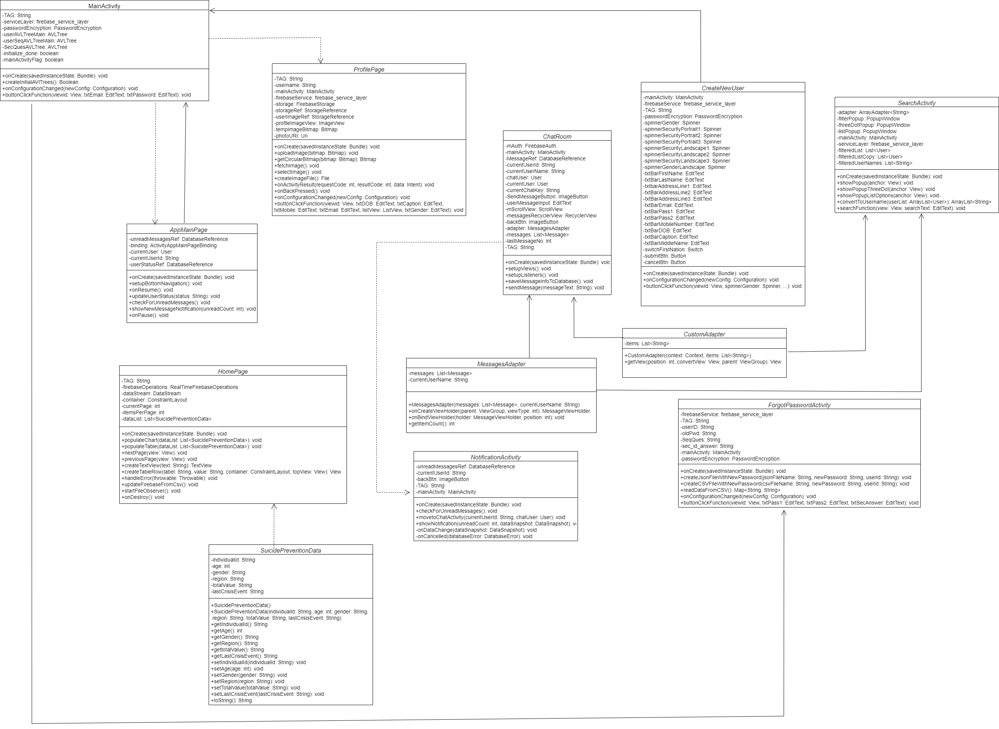

# [G11 - Team AncestraWell] Report

## **Research and Motivations**

*AncestraWell* is a mobile app designed to support the social and emotional wellbeing of Aboriginal and Torres Strait Islander people. It supports community and social connections, tailored for both Indigenous and non-Indigenous Australians, aligning with the goals of the Close the Gap initiative. *More details provided in Section 3.*

**Research Foundation**

Our app, AncestraWell, is firmly backed by extensive research and community engagement. It is not merely a student project, but given the circumstances it is a well-researched initiative grounded in various sources to ensure cultural sensitivity, contextualized engagement and unique positioning. Our research included:

**Quantitative and Qualitative Research:**

*We analyzed data from various websites, apps, research articles, and community blogs [Preliminary Research.pdf](Preliminary%20Research.pdf)*

**Community Engagement:**

*We conducted two meetings with ANU Wellbeing and consulted with local Indigenous communities to understand their needs and gain insights on how they would perceive our idea of the app and what characters should or should not be there to ensure cultural sensitivity and engagement.*

**Academic Research:**

*One standout study that guided our app development is the NCBI’s ‘Codeveloping a multibehavioural mobile phone app to enhance social and emotional well-being and reduce health risks among Aboriginal and Torres Strait Islander women during preconception and pregnancy.’ [https://www.ncbi.nlm.nih.gov/pmc/articles/PMC8614130/]  This study provided extensive qualitative and quantitative data, validating our app’s direction and future potential:*

*It provided critical insights and guided our approach in creating an app aimed at improving the wellbeing of Aboriginal and Torres Strait Islander women. The research highlighted several key points:*

> **Engagement and Features:** The study found that mobile apps need to have features that users are already familiar with and frequently use. Apps that encouraged daily or multiple daily interactions were the most effective. Community and social connections were identified as the primary drivers for increased engagement. The research emphasized the importance of incorporating social interaction features, while also ensuring these forums are moderated to provide relevant and accurate advice.

> **Personalized User Experience:** The user experience should be personalized based on demographic and health-related questions to ensure that the information provided is relevant. For instance, non-smokers should not be shown smoking cessation information. Content should be concise and to the point, with a strong recommendation for video content. The study also highlighted the need for careful consideration of language, as different Aboriginal communities use different words.

> **Platform Accessibility:** It was essential for the app to be available on both Android and iOS platforms since women possessed both types of smartphones. The visual look and feel of the app were also important to the users.

> **Extensive Consultation and Design:** Developing an app for Aboriginal communities requires extensive consultation, negotiation, and design work. Using a strong theoretical foundation and a consultative approach adds rigour to the process.

> **Multi-health Behaviour Interventions:** Addressing multiple risk factors simultaneously is an emerging area in public health research. Aboriginal young people are early adopters of new technologies and avid users of social media, making a mobile app a practical tool for engagement.

> **Statistics:** The study provided valuable statistics: 94% of Aboriginal women in NSW reported having a smartphone they could download an app to, and around 90% had phone or data credit most of the time. When asked to nominate their top three topics for an app, 82% included social and emotional wellbeing, 55% nutrition, 31% bush tucker, 22% to stop smoking, 10% pregnancy, and 8% to stop alcohol or drugs. Women expressed a desire for an app that incorporated culture, history, and art.

> The research article's insights have been valuable in shaping our app's development. By understanding the importance of community connection, personalized content, and culturally appropriate design, we aim to create an app that not only supports social and emotional wellbeing but also resonates deeply with Aboriginal and Torres Strait Islander women. Our unique positioning lies in integrating these findings to develop a comprehensive and engaging platform tailored to their specific needs and preferences.

This comprehensive research ensured that AncestraWell is culturally sensitive, uniquely positioned, and deeply understands its audience, aiming to provide a meaningful impact beyond the scope of our COMP2100/6442 course.

## Table of Contents

1. [Team Members and Roles](#team-members-and-roles)
2. [Summary of Individual Contributions](#summary-of-individual-contributions)
3. [Application Description](#application-description)
4. [Application UML](#application-uml)
5. [Application Design and Decisions](#application-design-and-decisions)
6. [Summary of Known Errors and Bugs](#summary-of-known-errors-and-bugs)
7. [Testing Summary](#testing-summary)
8. [Implemented Features](#implemented-features)
9. [Team Meetings](#team-meetings)
10. [Conflict Resolution Protocol](#conflict-resolution-protocol)

## Administrative
- Firebase Repository Link: <https://console.firebase.google.com/project/comp2100-groupproject/overview>
   - Confirm: I have already added comp21006442@gmail.com as a Developer to the Firebase project prior to due date.
- Two user accounts for markers' access are usable on the app's APK (do not change the username and password unless there are exceptional circumstances. Note that they are not real e-mail addresses in use):
   - Username: comp2100@anu.edu.au	Password: comp2100
   - Username: comp6442@anu.edu.au	Password: comp6442

## Team Members and Roles
The key area(s) of responsibilities for each member

| UID   |         Name         |                                                                              Role |
|:------|:--------------------:|----------------------------------------------------------------------------------:|
| [u7670692] |   [Aditya Iyengar]   | [Overall UI Layout, Backend Firebase Implementation and connectivity, DataStream] |
| [u7726856] | [Divyesh Srivastava] |                                              [Lead, DAO, UI Layout, Profile Page] |
| [u7517790] |    [Omair Soomro]    |                                                  [UI Layout, Research, AVL Trees] |
| [u7704695] |    [Onam Dumbare]    |                                                           [DataStream, UI Layout] |
| [u7726995] |   [Saksham Gupta]    |                                                          [Search, Data Structure] |

## Summary of Individual Contributions

Specific details of individual contribution of each member to the project.

Each team member is responsible for writing **their own subsection**.

A generic summary will not be acceptable and may result in a significant lose of marks.

*[Summarise the contributions made by each member to the project, e.g. code implementation, code design, UI design, report writing, etc.]*

*[Code Implementation. Which features did you implement? Which classes or methods was each member involved in? Provide an approximate proportion in pecentage of the contribution of each member to the whole code implementation, e.g. 30%.]*

*you should ALSO provide links to the specified classes and/or functions*
Note that the core criteria of contribution is based on `code contribution` (the technical developing of the App).

1. **u7726856, Divyesh Srivastava**  
    Kindly note that in GIT, I have my commits with 2 different ANU id’s 
    * divyeshanuj.srivastava@anu.edu.au
    * u7726856@anu.edu.au
   
       Please note that both these are my commits in GIT.
       I have 20% contribution, as follows:

   - **Code Contribution in the final App**

     - Feature DAO design pattern - connect to firebase:
       - [firebase_service_layer.java](https://gitlab.cecs.anu.edu.au/u7726856/gp-24s1/-/blob/main/src/app/src/main/java/com/example/g11_group_application/firebase_connection_DAO/firebase_service_layer.java)

     - In DAO implementation, below mentioned enums were also implemented with it. These enums contain the names of the backend tables, firebase email and password, individual filenames, primary key attributes of each table.
       - [FirestoreSchema.java](https://gitlab.cecs.anu.edu.au/u7726856/gp-24s1/-/blob/main/src/app/src/main/java/com/example/g11_group_application/firebase_connection_DAO/FirestoreSchema.java?ref_type=heads)

       - [firebase_backend_Components.java](https://gitlab.cecs.anu.edu.au/u7726856/gp-24s1/-/blob/main/src/app/src/main/java/com/example/g11_group_application/firebase_connection_DAO/firebase_backend_Components.java?ref_type=heads)

       - [firebase_filenames.java](https://gitlab.cecs.anu.edu.au/u7726856/gp-24s1/-/blob/main/src/app/src/main/java/com/example/g11_group_application/firebase_connection_DAO/firebase_filenames.java?ref_type=heads)

     - Firebase connection instance creation was done in:
       - [firebase_primary_key_attributes.java](https://gitlab.cecs.anu.edu.au/u7726856/gp-24s1/-/blob/main/src/app/src/main/java/com/example/g11_group_application/firebase_connection_DAO/firebase_primary_key_attributes.java?ref_type=heads)
     - Created the MainActivity. Main activity is the start page for our app which  has been implemented in the following 
       - [MainActivity.java](https://gitlab.cecs.anu.edu.au/u7726856/gp-24s1/-/blob/main/src/app/src/main/java/com/example/g11_group_application/UI_Layer/MainActivity.java?ref_type=heads), 
       - [activity_main.xml](https://gitlab.cecs.anu.edu.au/u7726856/gp-24s1/-/blob/main/src/app/src/main/res/layout/activity_main.xml?ref_type=heads)

- Password encryption part - this class will be encrpyting the firebase email using Shift-Cipher encoding and password in 3-DES encryption. When logging in to Firebase console using this email and password, both are decrypted using the method described inside this class. Also, the passwords for users are stored in SHA-256 hash encryption which is encrypted and verified in this class. The link for the same is as follws:
    - [PasswordEncryption.java](https://gitlab.cecs.anu.edu.au/u7726856/gp-24s1/-/blob/main/src/app/src/main/java/com/example/g11_group_application/Service_layer/PasswordEncryption.java?ref_type=heads)

  - Profile page - this class contains the information of the user in the profile page as well as the image view. Backend (java) and front-end (XML) was done in the following class:
    - [ProfilePage.java](https://gitlab.cecs.anu.edu.au/u7726856/gp-24s1/-/blob/main/src/app/src/main/java/com/example/g11_group_application/UI_Layer/ProfilePage.java?ref_type=heads)

  - Custom Adapter for list view
    - [CustomAdapter.java](https://gitlab.cecs.anu.edu.au/u7726856/gp-24s1/-/blob/main/src/app/src/main/java/com/example/g11_group_application/UI_Layer/CustomAdapter.java?ref_type=heads)

  - Forgot Password backend – Implemented security question validation in backend: 
    - [ForgotPasswordActivity.java](https://gitlab.cecs.anu.edu.au/u7726856/gp-24s1/-/blob/main/src/app/src/main/java/com/example/g11_group_application/UI_Layer/ForgotPasswordActivity.java?ref_type=heads)

  - Added few extra fields in UI of create new user page by implementing landscape and portrait properties: 
    - [CreateNewUser.java](https://gitlab.cecs.anu.edu.au/u7726856/gp-24s1/-/blob/main/src/app/src/main/java/com/example/g11_group_application/UI_Layer/CreateNewUser.java?ref_type=heads)

  - Corrected the data model to store and manage individual records in the CSV file for the required fields: 
    - [SuicidePreventionData.java](https://gitlab.cecs.anu.edu.au/u7726856/gp-24s1/-/blob/main/src/app/src/main/java/com/example/g11_group_application/UI_Layer/SuicidePreventionData.java?ref_type=heads).

- **Code and App Design**

    - Designed Data Object layer connection with the firebase database.

    - Implementation of the SHA-256 encryption of password for data security.

    - Proposed the high-level concept and CFL for the app.

- **Others**: (only if significant and significantly different from an "average contribution")
  - Designed Data Object layer connection with the firebase database.
  - Designed the front-end and backend part of the profile page.
  - Made significant changes in other parts of the codes and implementations.
  - Implementation of the SHA-256, 3-DES and Shift-Cipher encryption of password for data security.
  - Proposed the high-level concept and CFL for the app.
  - Was leading the team with a clear view of what to do in the app.
  - Conducted the meetings regularly, to ensure smooth functioning.
  - issued the issues and distributed them to each member of the group to close.

  

  

2. **u7670692, Aditya Iyengar**  I have 20% contribution, as follows:  

- **Code Contribution in the final App**
  - Firebase Firestore Database – Firestore database creation: [Firebase_Console_link](https://console.firebase.google.com/u/1/project/ancw-softcon/overview)
  - CSV to JSON Converter function – Implemented a separate class which is translates csv data to json for firebase uploads 
    - [csv_to_json_convertor.java](https://gitlab.cecs.anu.edu.au/u7726856/gp-24s1/-/blob/main/src/app/src/main/java/com/example/g11_group_application/firebase_connection_DAO/csv_to_json_convertor.java?ref_type=heads)
  - Forgot Password GUI and backend – Implemented Forgot Password page GUI and constructed the backend processes of userID and password authentication, verification, data search, retrieval and update/insert procedures: 
    - [ForgotPasswordActivity.java](https://gitlab.cecs.anu.edu.au/u7726856/gp-24s1/-/blob/main/src/app/src/main/java/com/example/g11_group_application/UI_Layer/ForgotPasswordActivity.java?ref_type=heads)
    - [activity_forgot_password.xml](https://gitlab.cecs.anu.edu.au/u7726856/gp-24s1/-/blob/main/src/app/src/main/res/layout/activity_forgot_password.xml)
  - Search Activity GUI implementation and fixing: 
    - [SearchActivity.java](https://gitlab.cecs.anu.edu.au/u7726856/gp-24s1/-/blob/main/src/app/src/main/java/com/example/g11_group_application/UI_Layer/SearchActivity.java?ref_type=heads) 
    - [activity_search.xml](https://gitlab.cecs.anu.edu.au/u7726856/gp-24s1/-/blob/main/src/app/src/main/res/layout/activity_search.xml)
  - App main page basic GUI and worked on it further to complete it: 
    - [AppMainPage.java](https://gitlab.cecs.anu.edu.au/u7726856/gp-24s1/-/blob/main/src/app/src/main/java/com/example/g11_group_application/UI_Layer/AppMainPage.java?ref_type=heads) 
    - [activity_app_main_page.xml](https://gitlab.cecs.anu.edu.au/u7726856/gp-24s1/-/blob/main/src/app/src/main/res/layout/activity_app_main_page.xml)
  - Corrected and improved UI of create new user page by implementing landscape and portrait properties: 
    - [CreateNewUser.java](https://gitlab.cecs.anu.edu.au/u7726856/gp-24s1/-/blob/main/src/app/src/main/java/com/example/g11_group_application/UI_Layer/CreateNewUser.java?ref_type=heads)
  - Data Streaming - Built the entire tabular and graphical display format for live data streaming upto 3000 records, and continued and finalized establishment of real-time connectivity with the RealTime database to complete DataStream: 
    - [HomePage.java](https://gitlab.cecs.anu.edu.au/u7726856/gp-24s1/-/blob/main/src/app/src/main/java/com/example/g11_group_application/UI_Layer/HomePage.java) 
    - [activity_home_page.xml](https://gitlab.cecs.anu.edu.au/u7726856/gp-24s1/-/blob/main/src/app/src/main/res/layout/activity_home_page.xml)
  - Chatting Functionality - Built the GUI for chatting application: 
    - [ChatRoom.java](https://gitlab.cecs.anu.edu.au/u7726856/gp-24s1/-/blob/main/src/app/src/main/java/com/example/g11_group_application/UI_Layer/ChatRoom.java)
    - [activity_chat_room.xml](https://gitlab.cecs.anu.edu.au/u7726856/gp-24s1/-/blob/main/src/app/src/main/res/layout/activity_chat_room.xml)

  

3. **u7517790, Omair Soomro**  I have 20% contribution, as follows:  

- **Code Contribution in the final App**

  - Create New User - in this, the work is done at backend. All the values from the UI is first inserted in the AVL tree. Once that is completed, the data is written into CSV file and then into JSON format. This JSON file is then inserted into backend. Also, as soon as the data is inserted in backend, the user will be able to login to the system using their credentials. 
    - [CreateNewUser.java](https://gitlab.cecs.anu.edu.au/u7726856/gp-24s1/-/blob/main/src/app/src/main/java/com/example/g11_group_application/UI_Layer/CreateNewUser.java)

  - Forgot Password Activity - the work is done at UI layer. Two fields were added for security question and an edit text to type the answer to the question. Only if the password is correct and the answer to the security question is correct, will the data be stored in the database. This is used as a fail-safe method to ensure the security of the user data.
    - [ForgotPasswordActivity.java](https://gitlab.cecs.anu.edu.au/u7726856/gp-24s1/-/blob/main/src/app/src/main/java/com/example/g11_group_application/UI_Layer/ForgotPasswordActivity.java)
  - AVL – Searching the maximum value in the AVL tree. This is being used in creation of new login id. Min node search : Searching the minimum value in the AVL tree. Root node search : This searched the root node in the AVL tree. This will help us to identify where to traverse to find the nim node and the max node: 
    - [AVLTree.java](https://gitlab.cecs.anu.edu.au/u7726856/gp-24s1/-/blob/main/src/app/src/main/java/com/example/g11_group_application/Service_layer/AVLTree.java)

  - This is the main page after login to the Application:
    - [AppMainPage.java](https://gitlab.cecs.anu.edu.au/u7726856/gp-24s1/-/blob/main/src/app/src/main/java/com/example/g11_group_application/UI_Layer/AppMainPage.java?ref_type=heads)

  - This is Home Page class that displays data in the table and the chart. Completed the tab onClick handling on this page.
    - [HomePage.java](https://gitlab.cecs.anu.edu.au/u7726856/gp-24s1/-/blob/main/src/app/src/main/java/com/example/g11_group_application/UI_Layer/HomePage.java?ref_type=heads)

  - This is Sarch activity page that that handles the searching of the other users. Completed the tab onClick handling on this page.
    - [SearchActivity.java](https://gitlab.cecs.anu.edu.au/u7726856/gp-24s1/-/blob/main/src/app/src/main/java/com/example/g11_group_application/UI_Layer/SearchActivity.java?ref_type=heads)

         

- **Code and App Design**

  - Designed the Control Flow Diagrams for the entire Software from the Login to aall the tabs, that would also assist with visualization and test cases.

  - Assisted in Design Discussion and conclusion about UI

  - Before starting the app, I thoroughly researched various websites and apps focused on social and emotional wellbeing for Indigenous Canadians, Americans, and Australians. [ATTACH DOCUMENT PDF]. This research aimed to ensure our app's unique positioning and provide opportunities to extend it beyond this course after approvals.

  

- **Others**: (only if significant and significantly different from an "average contribution")

    - Wrote the report and the Meeting minutes. Also created the video.

    - Got practical advice via ANU Wellbeing to contact First Nation citizens and plan on how to be culturally sensitive while strategizing to work through the further development of the app, beyond this course.

    - After exploring all 34 collective goals of the UN and Closing the Gap initiative, I suggested and advocated for creating an app to support Closing the Gap's 14th goal, naming it 'AncestraWell'. Focusing on the welfare of First Nations Australians, given their tragic mental health and historical context, was a practical cause for our group to support while studying in Australia. Although I was unable to secure a meeting with the National Centre for Aboriginal and Torres Strait Islander Wellbeing Research despite multiple attempts, I arranged meetings with ANU Wellbeing and local community members to understand their perspectives and what they would consider a culturally acceptable mobile app on this topic

  

4. **u7704695, Onam Dumbare**  I have 20% contribution, as follows:  

- **Code Contribution in the final App**

  - Feature DAO design pattern - connect to firebase: 
    - [firebase_service_layer.java](https://gitlab.cecs.anu.edu.au/u7726856/gp-24s1/-/blob/main/src/app/src/main/java/com/example/g11_group_application/firebase_connection_DAO/firebase_service_layer.java)

  - Created and worked on CreateNewUser page, which is used to create a new user in the system. This page is used to create a new user in the system.
    - [CreateNewUser.java](https://gitlab.cecs.anu.edu.au/u7726856/gp-24s1/-/blob/main/src/app/src/main/java/com/example/g11_group_application/UI_Layer/CreateNewUser.java)

  - Worked on Tabular datastream part of the app, which is used to display the data in a tabular format. This is used to display the data in a tabular format. 
    - [HomePage.java](https://gitlab.cecs.anu.edu.au/u7726856/gp-24s1/-/blob/main/src/app/src/main/java/com/example/g11_group_application/UI_Layer/HomePage.java)

  - Created the layout for message bubbles in the chatroom, which is used to display the messages in the chatroom. 
    - [message_item.xml](https://gitlab.cecs.anu.edu.au/u7726856/gp-24s1/-/blob/main/src/app/src/main/res/layout/message_item.xml) 
    - [message_item_sent.xml](https://gitlab.cecs.anu.edu.au/u7726856/gp-24s1/-/blob/main/src/app/src/main/res/layout/message_item_sent.xml) 
    - [message_background.xml](https://gitlab.cecs.anu.edu.au/u7726856/gp-24s1/-/blob/main/src/app/src/main/res/drawable/message_background.xml)

  - Created MessageAdapter file for chatroom, which is used to display the messages in the chatroom. 
    - [MessageAdapter.java](https://gitlab.cecs.anu.edu.au/u7726856/gp-24s1/-/blob/main/src/app/src/main/java/com/example/g11_group_application/UI_Layer/MessageAdapter.java)

  - Worked on Search and Main page GUI implementation: 
    - [activity_app_main_page.xml](https://gitlab.cecs.anu.edu.au/u7726856/gp-24s1/-/blob/main/src/app/src/main/res/layout/activity_app_main_page.xml) 
    - [activity_search.xml](https://gitlab.cecs.anu.edu.au/u7726856/gp-24s1/-/blob/main/src/app/src/main/res/layout/activity_search.xml)
  

   

- **Code and App Design**

  - Designed create new user page of the app.

  - Worked on the Layout of the Chatroom and Create new user.

  - Worked on search and Main page GUI as well.

  - Worked on displaying data stream in tabular format   

- **Others**: (only if significant and significantly different from an "average contribution")

  - Focused on drawing the UML diagram

  

5. **u7726995, Saksham Gupta**  I have 20% contribution, as follows:  
- **Code contribution in final app**
  - Feature Search Algorithm - class SearchToken: 
    - [SearchToken.java](https://gitlab.cecs.anu.edu.au/u7726856/gp-24s1/-/blob/main/src/app/src/main/java/com/example/g11_group_application/Service_layer/SearchToken.java)
  - class SearchTokeniser: 
    - [SearchTokeniser.java](https://gitlab.cecs.anu.edu.au/u7726856/gp-24s1/-/blob/main/src/app/src/main/java/com/example/g11_group_application/Service_layer/SearchTokenizer.java)
  - class SearchParser: 
    - [SearchParser.java](https://gitlab.cecs.anu.edu.au/u7726856/gp-24s1/-/blob/main/src/app/src/main/java/com/example/g11_group_application/Service_layer/SearchParser.java)
  - class SearchDateRangeQuery: 
    - [SearchDateRangeQuery.java](https://gitlab.cecs.anu.edu.au/u7726856/gp-24s1/-/blob/main/src/app/src/main/java/com/example/g11_group_application/Service_layer/SearchDateRangeQuery.java)
  - class SearchNameQuery: 
    - [SearchNameQuery.java](https://gitlab.cecs.anu.edu.au/u7726856/gp-24s1/-/blob/main/src/app/src/main/java/com/example/g11_group_application/Service_layer/SearchNameQuery.java?ref_type=heads)
  

  - Feature DataFiles - class AVLTree: 
    - [AVLTree.java](https://gitlab.cecs.anu.edu.au/u7726856/gp-24s1/-/blob/main/src/app/src/main/java/com/example/g11_group_application/Service_layer/AVLTree.java) 
  - class AVLNode: 
    - [AVLNode.java](https://gitlab.cecs.anu.edu.au/u7726856/gp-24s1/-/blob/main/src/app/src/main/java/com/example/g11_group_application/Service_layer/AVLNode.java?ref_type=heads) 
  - class NodeData: 
    - [NodeData.java](https://gitlab.cecs.anu.edu.au/u7726856/gp-24s1/-/blob/main/src/app/src/main/java/com/example/g11_group_application/Service_layer/NodeData.java)
  

  - Feature Chat Notification - class NotificationActivity: 
    - [NotificationActivity.java]( https://gitlab.cecs.anu.edu.au/u7726856/gp-24s1/-/blob/main/src/app/src/main/java/com/example/g11_group_application/UI_Layer/NotificationActivity.java)
  - class ChatRoom: 
    - [ChatRoom.java](https://gitlab.cecs.anu.edu.au/u7726856/gp-24s1/-/blob/main/src/app/src/main/java/com/example/g11_group_application/UI_Layer/ChatRoom.java)
  - class AppMainPage: 
    - [AppMainPage.java]( https://gitlab.cecs.anu.edu.au/u7726856/gp-24s1/-/blob/main/src/app/src/main/java/com/example/g11_group_application/UI_Layer/AppMainPage.java)
  

  - Model classes 
    - [User.java](https://gitlab.cecs.anu.edu.au/u7726856/gp-24s1/-/blob/main/src/app/src/main/java/com/example/g11_group_application/Service_layer/User.java)
    - [Message.java]( https://gitlab.cecs.anu.edu.au/u7726856/gp-24s1/-/blob/main/src/app/src/main/java/com/example/g11_group_application/Service_layer/Message.java)
    - class [UnreadMessageDetails.java](https://gitlab.cecs.anu.edu.au/u7726856/gp-24s1/-/blob/main/src/app/src/main/java/com/example/g11_group_application/Service_layer/UnreadMessageDetails.java)
  - Database Model Class
    - class [FireStoreScheme.java](https://gitlab.cecs.anu.edu.au/u7726856/gp-24s1/-/blob/main/src/app/src/main/java/com/example/g11_group_application/firebase_connection_DAO/FirestoreSchema.java)
  - Unit Testing - class AVLTreeTest: 
    - [AVLTreeTest.java](https://gitlab.cecs.anu.edu.au/u7726856/gp-24s1/-/blob/main/src/app/src/main/java/com/example/g11_group_application/Service_layer/AVLTreeTest.java)
    - class AVLTreeToJsonTest: [AVLTreeToJsonTest.java](https://gitlab.cecs.anu.edu.au/u7726856/gp-24s1/-/blob/main/src/app/src/main/java/com/example/g11_group_application/Service_layer/AVLTreeToJsonTest.java)
    - class TokenTest: [TokenTest.java](https://gitlab.cecs.anu.edu.au/u7726856/gp-24s1/-/blob/main/src/app/src/main/java/com/example/g11_group_application/Service_layer/TokenTest.java)
    - class SearchParserTest: [SearchParserTest](https://gitlab.cecs.anu.edu.au/u7726856/gp-24s1/-/blob/main/src/app/src/main/java/com/example/g11_group_application/Service_layer/SearchParserTest.java?ref_type=heads)  

- **Code and App Design**
  - Designed Data Structure, Tokeniser, Parser, Searcher.
  - Assisted in creating backend & GUI for chatroom
  - Optimized the GUI layouts for multiple activities and made them suitable for Landscape
  - Assisted in UI Design, designing the drafts of the app pages using Photoshop*
  - Made the app logo.

  

## Application Description

*AncestraWell is a mobile application designed to outstandingly align with one of the goals outlined by Close the Gap: "Aboriginal and Torres Strait Islander people enjoy high levels of social and emotional wellbeing". The app is designed to uniquely foster community and social wellbeing, built around First Nations cultures for both Indigenous and non-Indigenous Australians. The idea is to encourage and engaging platform for such inclusivity through social events, chatting, community-based groups, searching other users and updating status/caption for self-identification. Our project is driven by a commitment to support the mental health and wellbeing of Indigenous communities, particularly in combating the high rates of suicide that tragically impact these groups. We aim to create an app that not only serves an educational purpose during our course but also makes a meaningful impact beyond it. The core of our application is to foster social and emotional support through community engagement, accessible resources, and culturally sensitive content.*

### Application Use Cases and or Examples

**Example Scenario for AncestraWell:**

*Lily, a non-Indigenous Australian, has always been interested in learning more about First Nations cultures and supporting Indigenous communities. She finds AncestraWell and is intrigued by its purpose and community-based features. Lily registers on the app and joins a local group, "Melbourne Cultural Exchange," which organizes weekly events and discussions around Indigenous history and contemporary issues.   Through AncestraWell, Lily attends a gathering that focuses on storytelling and the significance of Dreamtime stories. She uses the app to chat with other members, learning more each day and participating actively in discussions. She updates her status regularly to reflect her learning journey, which encourages more of her friends to join and participate. Lily finds herself deeply connected and starts advocating for Indigenous rights more actively, using the resources and connections she's made through AncestraWell**

**Three Additional Short Cases:**

*-Case: Marcus Engages with Elders Marcus, an Indigenous youth from Brisbane, uses AncestraWell to connect with elders in his community. He participates in a virtual group called “Elders’ Wisdom,” where he listens to stories and receives advice on various cultural practices. Through these interactions, Marcus gains a deeper understanding of his heritage and shares his experiences on his profile, which helps raise awareness and pride among younger Indigenous members on the platform.*

*-Case: Sarah Finds Support Sarah, a Torres Strait Islander who recently moved to Sydney, feels isolated and disconnected from her community. She uses AncestraWell to find and join the “Sydney Islander Meetup” group. Through the app, she attends social gatherings and wellness workshops specifically tailored for Islanders, finding emotional support, and making new friends who share her background and experiences.*

*-Case: Emma’s Educational Campaign Emma, a teacher in a rural Australian school, uses AncestraWell to create an educational campaign about Indigenous history and rights. She collaborates with Indigenous activists and educators to produce content that she shares on the app, fostering a learning environment. Her campaign gains traction, and she organizes school visits and interactive sessions that are advertised and coordinated through AncestraWell, bringing real-world interactions back to the digital space for ongoing discussions.*

 

### Application UML

UML Attached: 

   
Control Flow Diagram Attached (also on github). This was at an early stage to help with visualization and test cases: [CFD's for Test Cases.pdf](..%2F..%2FFinal%20Report%2FCFD%27s%20for%20Test%20Cases.pdf) 

## Code Design and Decisions

- Tokenizer Description
  [SearchToken.java](https://gitlab.cecs.anu.edu.au/u7726856/gp-24s1/-/blob/main/src/app/src/main/java/com/example/g11_group_application/Service_layer/SearchToken.java?ref_type=heads)
  [SearchTokenizer.java](https://gitlab.cecs.anu.edu.au/u7726856/gp-24s1/-/blob/main/src/app/src/main/java/com/example/g11_group_application/Service_layer/SearchTokenizer.java?ref_type=heads)

- Purpose: The Tokenizer is designed to segment user input into discrete tokens that are crucial for parsing and subsequent query construction. Each token represents a semantic unit such as a name, a keyword, or a date, which are pivotal for directing the search process within the AVL Tree.
- Implementation Details: Uses regular expressions to categorize parts of the user input into types like FIRST_NAME, LAST_NAME, DATE, and KEYWORD. This process is essential for handling complex search queries and directing the parsing process accurately.
    
- Parser Description
  [SearchParser.java](https://gitlab.cecs.anu.edu.au/u7726856/gp-24s1/-/blob/main/src/app/src/main/java/com/example/g11_group_application/Service_layer/SearchParser.java?ref_type=heads)
  [SearchNameQuery.java](https://gitlab.cecs.anu.edu.au/u7726856/gp-24s1/-/blob/main/src/app/src/main/java/com/example/g11_group_application/Service_layer/SearchNameQuery.java?ref_type=heads)

- Purpose: The Parser interprets the tokens generated by the Tokenizer to create structured queries that interact with the AVL Tree. It understands and assembles these tokens based on a defined grammar which includes operators and field values to form comprehensive search conditions.  
- Grammar and Operations:
- Grammar: Consists of key fields followed by a comparator and then a value or list of values.
- Fields: Includes identifiers like FIRST_NAME, LAST_NAME, and DATE_OF_BIRTH, accommodating a range of comparators from equality to relational comparisons (e.g., less than, greater than).
- Functionality: Capable of constructing multi-field queries, considering complex interdependencies between different data types and fields.  
- AVL Tree Description
- Purpose: Acts as the central data structure for storing and organizing data efficiently. The AVL Tree is adapted to manage not only unique values but also handle duplicates gracefully by associating each key with multiple entries if necessary.
- Features:
- Modified Node Structure: Nodes can store multiple entries under the same key, accommodating scenarios where multiple records share key attributes (e.g., date of birth).
- Data Management: Utilizes a HashMap within each node to manage data associated with duplicated keys efficiently.
- Search Efficiency: Maintains balance through rotations and rebalancings to ensure that search operations are as efficient as possible, even as the dataset grows.
- Serialization/Deserialization: Includes capabilities to serialize the tree to JSON and deserialize it back, facilitating data persistence and transfer.  
- Search Workflow Motivation
- Process: Starts with the user input which is tokenized and parsed into a query. The query does not modify the data structure directly but forms a set of conditions that are applied to retrieve data from the AVL Tree.
- Efficiency: By creating a query condition from the parser output, the system ensures that search operations are executed efficiently. This approach minimizes redundant processing and potential errors that could arise from dynamically altering the data structure with each tokenized input.  
- System Integration and Scalability
- Scalability: Each component is designed to handle increasing amounts of data and complexity in user queries without significant performance degradation.
- Integration: Components are tightly integrated yet maintain clear boundaries, ensuring that changes in one (e.g., extending the tokenizer's capabilities) have minimal impact on others.

### Data Structures

We used the following data structures in our project:

1. AVLTree
* Objective: used as the main structure to store all models of data
* Code Locations: defined in 
  - [Class AVLTree.java](https://gitlab.cecs.anu.edu.au/u7726856/gp-24s1/-/blob/main/src/app/src/main/java/com/example/g11_group_application/Service_layer/AVLTree.java)
  - [AVLNode.java](https://gitlab.cecs.anu.edu.au/u7726856/gp-24s1/-/blob/main/src/app/src/main/java/com/example/g11_group_application/Service_layer/AVLNode.java?ref_type=heads)
  - [NodeData.java](https://gitlab.cecs.anu.edu.au/u7726856/gp-24s1/-/blob/main/src/app/src/main/java/com/example/g11_group_application/Service_layer/NodeData.java?ref_type=heads)
  - [User.java](https://gitlab.cecs.anu.edu.au/u7726856/gp-24s1/-/blob/main/src/app/src/main/java/com/example/g11_group_application/Service_layer/User.java?ref_type=heads)

* Reasons:
* It was an efficient way for storing a large data set in an easily searchable manner.
* Was modified based off of the regular AVL Tree, to be able to serialize to Json.
* Motivation described above

2. Hashmap (AVLTree)
* Objective: used for storing objects to attributes to firebase
* Code Locations:

Class [NodeData.java](https://gitlab.cecs.anu.edu.au/u7726856/gp-24s1/-/blob/main/src/app/src/main/java/com/example/g11_group_application/Service_layer/NodeData.java?ref_type=heads)
* Reasons:
* Hashmap allows us to map data of any object type, making it more flexible and mutable.
* Removes duplicate values, and is a type recognized by Java that can be converted to Json.
* Class [firebase_service_layer.java](https://gitlab.cecs.anu.edu.au/u7726856/gp-24s1/-/blob/main/src/app/src/main/java/com/example/g11_group_application/firebase_connection_DAO/firebase_service_layer.java?ref_type=heads)
* Several data structures have been used to implement this feature, which includes Hashmap, Map, String Array, List using List Array, etc. These are utilized to store the data for headers and data to be written in the CSV and JSON files. Furthermore, collection has been used to sort the data when fetching the data from firebase.
* Class [CreateNewUser.java](https://gitlab.cecs.anu.edu.au/u7726856/gp-24s1/-/blob/main/src/app/src/main/java/com/example/g11_group_application/UI_Layer/CreateNewUser.java?ref_type=heads) 
* [SearchActivity.java](https://gitlab.cecs.anu.edu.au/u7726856/gp-24s1/-/blob/main/src/app/src/main/java/com/example/g11_group_application/UI_Layer/SearchActivity.java?ref_type=heads) 
* and [ProfilePage.java](https://gitlab.cecs.anu.edu.au/u7726856/gp-24s1/-/blob/main/src/app/src/main/java/com/example/g11_group_application/UI_Layer/ProfilePage.java?ref_type=heads)
* Here the array list and List has been used as it was to be implemented in the Array Adapter for Spinner and List view

### Design Patterns

1. Singleton Pattern

* Objective: used for storing Conditions for Search feature.

* Code Locations: 
  * [SearchActivity.java](https://gitlab.cecs.anu.edu.au/u7726856/gp-24s1/-/blob/main/src/app/src/main/java/com/example/g11_group_application/UI_Layer/SearchActivity.java?ref_type=heads)
  * [SearchCompositeQuery.java](https://gitlab.cecs.anu.edu.au/u7726856/gp-24s1/-/blob/main/src/app/src/main/java/com/example/g11_group_application/Service_layer/SearchCompositeQuery.java?ref_type=heads)
  * [SearchNameQuery.java](https://gitlab.cecs.anu.edu.au/u7726856/gp-24s1/-/blob/main/src/app/src/main/java/com/example/g11_group_application/Service_layer/SearchNameQuery.java?ref_type=heads)
  * [SearchParser.java](https://gitlab.cecs.anu.edu.au/u7726856/gp-24s1/-/blob/main/src/app/src/main/java/com/example/g11_group_application/Service_layer/SearchParser.java?ref_type=heads)
  * [SearchQuery.java](https://gitlab.cecs.anu.edu.au/u7726856/gp-24s1/-/blob/main/src/app/src/main/java/com/example/g11_group_application/Service_layer/SearchQuery.java?ref_type=heads)
  * [SearchToken.java](https://gitlab.cecs.anu.edu.au/u7726856/gp-24s1/-/blob/main/src/app/src/main/java/com/example/g11_group_application/Service_layer/SearchToken.java?ref_type=heads)
  * [SearchTokenizer.java](https://gitlab.cecs.anu.edu.au/u7726856/gp-24s1/-/blob/main/src/app/src/main/java/com/example/g11_group_application/Service_layer/SearchTokenizer.java?ref_type=heads)
  * [User.java](https://gitlab.cecs.anu.edu.au/u7726856/gp-24s1/-/blob/main/src/app/src/main/java/com/example/g11_group_application/Service_layer/User.java?ref_type=heads)

* The Condition is accessed from multiple locations and changed in a varying number of ways by the Search Parser

* Having only one instance of the Condition means that there will not be duplicates of the condition to confuse the code

* This could have been a data structure with multiple instances but having only one was streamlines and prevents mistakes

2. DAO Method

* Objective: used to abstract and encapsulate all access to the data source. Manages the connection to the data source to obtain and store data.

* Code Locations: defined in: 
  * [firebase_service_layer.java](https://gitlab.cecs.anu.edu.au/u7726856/gp-24s1/-/blob/main/src/app/src/main/java/com/example/g11_group_application/firebase_connection_DAO/firebase_service_layer.java?ref_type=heads)
  * [firebaseDAO.java](https://gitlab.cecs.anu.edu.au/u7726856/gp-24s1/-/blob/main/src/app/src/main/java/com/example/g11_group_application/firebase_connection_DAO/firebaseDAO.java?ref_type=heads)

* Reasons:

* The DAO provides a centralized point for the database access operations, which makes the code cleaner and the database interactions easier to manage.

* Encapsulating access in a DAO makes it easy to change the underlying database implementation without affecting the rest of the application.

* It helps to separate the business logic from the data access logic, which enhances the maintainability and scalability of the application.

3. State Pattern

* Objective: used to alter the behavior of an object when its internal state changes. This can make complex state-dependent behavior more organized and easier to manage.

* Code Locations: [MainActivity.java](https://gitlab.cecs.anu.edu.au/u7726856/gp-24s1/-/blob/main/src/app/src/main/java/com/example/g11_group_application/UI_Layer/MainActivity.java?ref_type=heads)

4. Observer Pattern
* Objective: used to establish a one-to-many dependency between objects so that when one object changes state, all its dependents are notified and updated automatically.
* Code Locations: defined in [DataStream.java](https://gitlab.cecs.anu.edu.au/u7726856/gp-24s1/-/blob/main/src/app/src/main/java/com/example/g11_group_application/Service_layer/DataStream.java?ref_type=heads)

* Reasons:

* The pattern localizes state-specific behavior and partitions behavior for different states into separate state-derived classes.

* This simplifies the code in the context object by eliminating large conditional statements that alter behavior based on the state of the object.

* It increases modularity and makes it easier to add new states and transitions without altering existing state classes or the context.

### Parser

### <u>Grammar(s)</u>
The grammar is designed to parse queries that filter through attributes such as names and dates, and supports complex queries including date ranges and keyword-based filters.

Production Rules:

    <search>         ::=  <query> | <query> ; <search> 
    <query>          ::=  <keywordField> <keywordCondition> | <nameField> <nameCondition> | <dateField> <dateCondition> 
    <keywordField>   ::= "From:" | "To:" 
    <keywordCondition> ::= <dateField> <dateCondition> 
    <nameField>      ::= <Name> 
    <nameCondition>  ::= Contains <Name> 
    <dateField>      ::= <Date> 
    <dateCondition>  ::= : <dateList> | > <Date> | < <Date> 
    <dateList>       ::= <Date> | <Date>, <dateList>
### <u>Tokenizers and Parsers</u>

- Tokenizer:
    - The tokenizer is tailored to parse specific keywords such as "From:" and "To:", names, and dates formatted as YYYY-MM-DD. These elements are categorized into tokens based on their types (e.g., KEYWORD, DATE, NAME).
    - It uses regular expressions to identify and extract these tokens from the input string, converting them into a structured format that the parser can easily process.

- Parser:
    - The parser takes the tokens generated by the tokenizer and constructs structured queries. It supports complex queries involving date ranges and name searches. Keywords like "From:" and "To:" facilitate specifying starting and ending points for date ranges.
    - The parser ensures that the tokens are assembled into meaningful queries that are logically sound and adhere to the expected syntax dictated by the grammar.

### <u>Firebase</u>

Fire base authentication enables simple email-password authentication.

We are using firebase firestore database, firestore realtime database and firestore storage. In Firestore database, we store the details of the user like password (encrypted by SHA 256), Address, etc. Realtime database is used for DataStream purpose, handling notifications and chatting within the app. Firestore storage is used to store the profile picture of each user.
  

 

## Implemented Features

**17 Features**  
*We have implemented 17 features (Basic, Customer, and Additional)*   
*The sequence of features below is based on the flow of the video (features.mp4) as recommended*

1. [FB-Auth] Use Firebase to implement User Authentication/Authorisation. (easy)
   * *Custom Feature*
   * Code: [firebase_service_layer.java ](https://gitlab.cecs.anu.edu.au/u7726856/gp-24s1/-/blob/main/src/app/src/main/java/com/example/g11_group_application/firebase_connection_DAO/firebase_service_layer.java?ref_type=heads)
   * Description and Justification of feature: This feature will connect to the firebase using the user id and password stored. So the first screen is the login screen. When you first launch an app, it instantly establishes a connection to the FB database using a specific email ID and pwd. Thisis important because we ll be storing and fetching the data throughout the application, hence we need to have a connectivity with the firebase.

2. [LogIn] Users must be able to log in (not necessarily sign up). (easy)
   * *Basic Feature*
   * Code:  [MainActivity.java](https://gitlab.cecs.anu.edu.au/u7726856/gp-24s1/-/blob/main/src/app/src/main/java/com/example/g11_group_application/UI_Layer/MainActivity.java?ref_type=heads)
   * Description and Justification of feature: The feature allows a user to login such that they retain an identity while in the app. We used Firebase Authentication to allow a user to login with a google email and password. It is the most critical basic feature.

3. [UI-Layout] Incorporate suitable layout adjustments in the UI components for portrait and landscape
   layout variants, as well as different screen sizes. (easy)
   * *Custom Feature*
   * Code: 
   - [AppMainPage.java ](https://gitlab.cecs.anu.edu.au/u7726856/gp-24s1/-/blob/main/src/app/src/main/java/com/example/g11_group_application/UI_Layer/AppMainPage.java?ref_type=heads)
   - [ChatRoom.java](https://gitlab.cecs.anu.edu.au/u7726856/gp-24s1/-/blob/main/src/app/src/main/java/com/example/g11_group_application/UI_Layer/ChatRoom.java?ref_type=heads)
   - [CreateNewUser.java](https://gitlab.cecs.anu.edu.au/u7726856/gp-24s1/-/blob/main/src/app/src/main/java/com/example/g11_group_application/UI_Layer/CreateNewUser.java?ref_type=heads)
   - [ForgotPasswordActivity.java](https://gitlab.cecs.anu.edu.au/u7726856/gp-24s1/-/blob/main/src/app/src/main/java/com/example/g11_group_application/UI_Layer/ForgotPasswordActivity.java?ref_type=heads)
   - [UI_Layer/HomePage.java](https://gitlab.cecs.anu.edu.au/u7726856/gp-24s1/-/blob/main/src/app/src/main/java/com/example/g11_group_application/UI_Layer/HomePage.java?ref_type=heads)
   - [MainActivity.java](https://gitlab.cecs.anu.edu.au/u7726856/gp-24s1/-/blob/main/src/app/src/main/java/com/example/g11_group_application/UI_Layer/MainActivity.java?ref_type=heads)
   - [ProfilePage.java](https://gitlab.cecs.anu.edu.au/u7726856/gp-24s1/-/blob/main/src/app/src/main/java/com/example/g11_group_application/UI_Layer/ProfilePage.java?ref_type=heads)
   - [SearchActivity.java](https://gitlab.cecs.anu.edu.au/u7726856/gp-24s1/-/blob/main/src/app/src/main/java/com/example/g11_group_application/UI_Layer/SearchActivity.java?ref_type=heads)
   * Description and Justification of feature: In all the UI throughout the app, both portrait and Landscape orientation has been handled. This is a basic standard to facilitate better user experience.

4. [LoadShowData] Load and display data instances from your dataset. Choose an appropriate format
   to present the different types of data. (easy)
   * *Basic Feature*
   * Code: 
   - https://gitlab.cecs.anu.edu.au/u7726856/gp-24s1/-/blob/main/src/app/src/main/java/com/example/g11_group_application/UI_Layer/ForgotPasswordActivity.java?ref_type=heads
   - https://gitlab.cecs.anu.edu.au/u7726856/gp-24s1/-/blob/main/src/app/src/main/java/com/example/g11_group_application/UI_Layer/HomePage.java?ref_type=heads
   -  https://gitlab.cecs.anu.edu.au/u7726856/gp-24s1/-/blob/main/src/app/src/main/java/com/example/g11_group_application/UI_Layer/ProfilePage.java?ref_type=heads
   - https://gitlab.cecs.anu.edu.au/u7726856/gp-24s1/-/blob/main/src/app/src/main/java/com/example/g11_group_application/UI_Layer/SearchActivity.java?ref_type=heads
   * Description and Justification of feature: The user can login into the system just after creating the login credentials  We used Firebase realtime database alongside android studios UI language to redisplay data on changes to the realtime database in order allow the user access to the most current data. It is a mandatory feature and is used in forgot password, homepage, profile page, search andcreate new user.

5. [Encryption] It encrypts the sensitive data when storing in the database or any local files. Also, it decrypts the data within the code wherever necessary (medium)
   * *Additional Feature*
   * Code: https://gitlab.cecs.anu.edu.au/u7726856/gp-24s1/-/blob/main/src/app/src/main/java/com/example/g11_group_application/Service_layer/PasswordEncryption.java?ref_type=heads
   * Description and Justification of feature: Once you click submit on ‘Forgot Passwords’ protocols, your password will be encrypted using SHA256 hashing and sorted in the Database on the spot. The password of any user is personal information which when leaked will result in the leak of their private data. This is critical for privacy.

6. [FB-Persist] Use Firebase to persist all data used in your app. (medium)
   * *Custom Feature*
   * Code: 
   - https://gitlab.cecs.anu.edu.au/u7726856/gp-24s1/-/blob/main/src/app/src/main/java/com/example/g11_group_application/UI_Layer/ForgotPasswordActivity.java?ref_type=heads
   - https://gitlab.cecs.anu.edu.au/u7726856/gp-24s1/-/blob/main/src/app/src/main/java/com/example/g11_group_application/UI_Layer/ProfilePage.java?ref_type=heads
   - https://gitlab.cecs.anu.edu.au/u7726856/gp-24s1/-/blob/main/src/app/src/main/java/com/example/g11_group_application/UI_Layer/CreateNewUser.java?ref_type=heads
   * Description and Justification of feature: Signup, forgot password, and almost everywhere in the app, data is either fetched from the database or stored in the database. This feature ensures that user information is persistently available, even if the user changes devices. By leveraging Firebase's real-time database capabilities, data consistency and availability are maintained, providing a seamless user experience. Firebase also offers scalability and security, which are crucial for managing user data efficiently and securely.

7. [DataFiles] Create a dataset with at least 2,500 valid data instances, each representing a meaningful
   piece of information in your app. The data should be represented and stored in a structured format
   taught in the course. (easy)
   * *Custom Feature*
   * Code: 
   - https://gitlab.cecs.anu.edu.au/u7726856/gp-24s1/-/blob/main/src/app/src/main/java/com/example/g11_group_application/UI_Layer/HomePage.java?ref_type=heads
   - https://gitlab.cecs.anu.edu.au/u7726856/gp-24s1/-/blob/main/src/app/src/main/java/com/example/g11_group_application/UI_Layer/SuicidePreventionData.java?ref_type=heads
   - https://gitlab.cecs.anu.edu.au/u7726856/gp-24s1/-/blob/main/src/app/src/main/java/com/example/g11_group_application/firebase_connection_DAO/DataStream.java?ref_type=heads
   * Description and Justification of feature: This is our homepage, and captures and displays the tragic data of suicide rates amongst First Nation’s Australians. This is essentially the provision of facts.   This is important because it provides real life data sets for informed decisions and actions.

8. [Data-Formats] Read data from local files in at least 2 different formats (JSON, XML, etc.). (easy)
   * *Custom Feature*
   * Code: 
   - https://gitlab.cecs.anu.edu.au/u7726856/gp-24s1/-/blob/main/src/app/src/main/java/com/example/g11_group_application/firebase_connection_DAO/firebase_service_layer.java?ref_type=heads
   - https://gitlab.cecs.anu.edu.au/u7726856/gp-24s1/-/blob/main/src/app/src/main/java/com/example/g11_group_application/UI_Layer/HomePage.java?ref_type=heads
   * Description and Justification of feature: The app is reading from CSV and JSON files. We are reading a CSV file which is one of the features of Data format, and storing the data in the DB and displaying the data on frontend on real time. Also JSON format is whatever data we are storing from create new user class, forgot password class and profile page.  It is first written into JSON file, these files are read and then uploaded into the database.  The reason for its essence is that the person data for users is not stored in a realtime environment, rather it is stores in a static environment.

9. [FB-Persist-extension]: Without restarting, the app should be updated synchronously as
   the remote database (Firebase) is updated. This means that users will be able to see the
   instant updates from another user/content provider. (hard)
   * Custom Feature*
   * Code: 
    - https://gitlab.cecs.anu.edu.au/u7726856/gp-24s1/-/blob/main/src/app/src/main/java/com/example/g11_group_application/UI_Layer/HomePage.java?ref_type=heads
    - https://gitlab.cecs.anu.edu.au/u7726856/gp-24s1/-/blob/main/src/app/src/main/java/com/example/g11_group_application/UI_Layer/NotificationActivity.java?ref_type=heads
    - https://gitlab.cecs.anu.edu.au/u7726856/gp-24s1/-/blob/main/src/app/src/main/java/com/example/g11_group_application/UI_Layer/ChatRoom.java?ref_type=heads
    - https://gitlab.cecs.anu.edu.au/u7726856/gp-24s1/-/blob/main/src/app/src/main/java/com/example/g11_group_application/firebase_connection_DAO/RealTimeFirebaseOperations.java?ref_type=heads
   * Description and Justification of feature: FB persist extension is implemented for chatting (Chat room class), notifications and data stream. It is partially implemented because we want the messages to be transferred to the other users immediately.

10. [Data-Graphical] Create a Graphical report viewer to see a report of some useful data from your
    app. No marks will be awarded if the report is non-graphical. (medium)
    * *Custom Feature*
    * Code: https://gitlab.cecs.anu.edu.au/u7726856/gp-24s1/-/blob/main/src/app/src/main/java/com/example/g11_group_application/UI_Layer/HomePage.java?ref_type=heads
    * Description and Justification of feature: Data graphical we are using the line graph to depict the age versus the total value of the average rate of the factors. This is was a choice for visualization and an effective strategy for engagement. Data graphical representation is achieved using a line graph to depict the age versus the total value of the average rate of the factors. This choice of visualization effectively conveys complex data in an understandable format. Visual representation of data helps users quickly grasp trends and patterns, making it an essential feature for data-driven insights and decision-making. The graphical report viewer enhances the app's usability by providing intuitive and interactive data visualization, crucial for user engagement and comprehension.

11. [Search] Users must be able to search for information on your app. (medium)
    Given the user's input based on pre-defined grammar(s), a query processor "understands" and
    retrieves the information that meets the user's query. The usag is dependent on your app theme.
    * *Basic Feature*
    * Code: 
    - https://gitlab.cecs.anu.edu.au/u7726856/gp-24s1/-/blob/main/src/app/src/main/java/com/example/g11_group_application/UI_Layer/SearchActivity.java?ref_type=heads
    - https://gitlab.cecs.anu.edu.au/u7726856/gp-24s1/-/blob/main/src/app/src/main/java/com/example/g11_group_application/Service_layer/SearchCompositeQuery.java?ref_type=heads
    - https://gitlab.cecs.anu.edu.au/u7726856/gp-24s1/-/blob/main/src/app/src/main/java/com/example/g11_group_application/Service_layer/SearchNameQuery.java?ref_type=heads
    - https://gitlab.cecs.anu.edu.au/u7726856/gp-24s1/-/blob/main/src/app/src/main/java/com/example/g11_group_application/Service_layer/SearchParser.java?ref_type=heads
    - https://gitlab.cecs.anu.edu.au/u7726856/gp-24s1/-/blob/main/src/app/src/main/java/com/example/g11_group_application/Service_layer/SearchQuery.java?ref_type=heads
    - https://gitlab.cecs.anu.edu.au/u7726856/gp-24s1/-/blob/main/src/app/src/main/java/com/example/g11_group_application/Service_layer/SearchToken.java?ref_type=heads
    - https://gitlab.cecs.anu.edu.au/u7726856/gp-24s1/-/blob/main/src/app/src/main/java/com/example/g11_group_application/Service_layer/SearchTokenizer.java?ref_type=heads
    - https://gitlab.cecs.anu.edu.au/u7726856/gp-24s1/-/blob/main/src/app/src/main/java/com/example/g11_group_application/Service_layer/User.java?ref_type=heads
    * Description and Justification of feature: The user can use rather natural language to apply a search condition to the data which is displayed. A search string is tokenized and then parsed to alter a Condition which is used to filter the data. The filtered data is then displayed. This feature is essential for finding other users in any virtual social setting, ensuring that users can efficiently locate relevant information or contacts. The implementation enhances user experience by providing a powerful and flexible search functionality, making data retrieval intuitive and efficient.

12. [Search-Filter] Sort and filter a list of items returned from searches, with the use of suitable UI
    components. (easy)
    * *Custom Feature*
    * Code: https://gitlab.cecs.anu.edu.au/u7726856/gp-24s1/-/blob/main/src/app/src/main/java/com/example/g11_group_application/UI_Layer/SearchActivity.java?ref_type=heads
    * Description and Justification of feature: Then there is a search filter which filters as per the DOB in yyyy-MM-DD format. Or you can type a partial name and the dropdown displays. Also it will sort in ascending order based on precedence. So there are two filters from and to, which filters DOB from or til the date. It is important for convenience and hence a completely custom feature.

13. [P2P-DM] Provide users with the ability to message each other directly in private. (hard)
    * *Custom Feature*
    * Code: 
    - https://gitlab.cecs.anu.edu.au/u7726856/gp-24s1/-/blob/main/src/app/src/main/java/com/example/g11_group_application/UI_Layer/ChatRoom.java?ref_type=heads
    - https://gitlab.cecs.anu.edu.au/u7726856/gp-24s1/-/blob/main/src/app/src/main/java/com/example/g11_group_application/firebase_connection_DAO/RealTimeFirebaseOperations.java?ref_type=heads
    - https://gitlab.cecs.anu.edu.au/u7726856/gp-24s1/-/blob/main/src/app/src/main/java/com/example/g11_group_application/UI_Layer/MessagesAdapter.java?ref_type=heads
    - https://gitlab.cecs.anu.edu.au/u7726856/gp-24s1/-/blob/main/src/app/src/main/java/com/example/g11_group_application/Service_layer/Message.java?ref_type=heads
    * Description and Justification of feature: After searching a name, and simply by clicking on it, you get an option to chat. Clicking on it will open this screen where you can chat in real-time fast forward live chatting. This feature is crucial for fostering direct and immediate communication between users, enhancing the social and interactive aspects of the app. It leverages real-time database capabilities to ensure seamless and instantaneous messaging, which is essential for maintaining user engagement and providing a responsive communication platform.

14. [Interact-Micro] The ability to micro-interact with items/users (e.g. like, block, connect to another
    user, etc.) [stored in-memory]. (easy)
    * *Custom Feature*
    * Code: 
    - https://gitlab.cecs.anu.edu.au/u7726856/gp-24s1/-/blob/main/src/app/src/main/java/com/example/g11_group_application/UI_Layer/ChatRoom.java?ref_type=heads
    - https://gitlab.cecs.anu.edu.au/u7726856/gp-24s1/-/blob/main/src/app/src/main/java/com/example/g11_group_application/firebase_connection_DAO/RealTimeFirebaseOperations.java?ref_type=heads
    - https://gitlab.cecs.anu.edu.au/u7726856/gp-24s1/-/blob/main/src/app/src/main/java/com/example/g11_group_application/UI_Layer/MessagesAdapter.java?ref_type=heads
    - https://gitlab.cecs.anu.edu.au/u7726856/gp-24s1/-/blob/main/src/app/src/main/java/com/example/g11_group_application/Service_layer/Message.java?ref_type=heads
    * Description and Justification of feature: We decided to ensure users connect with each other and that the chats would be stored in the displayed. Also they would be displayed from wherever they login.

15. [Interact-Noti] The ability to send notifications for interactions (e.g., follow request, product viewed,
    etc.). A notification must be sent only after a predetermined number of interactions are set [e.g.,
    when ≥2 requests have been received or 2 follow requests have been received). (medium)
    * *Custom Feature*
    * Code: 
    - https://gitlab.cecs.anu.edu.au/u7726856/gp-24s1/-/blob/main/src/app/src/main/java/com/example/g11_group_application/UI_Layer/NotificationActivity.java?ref_type=heads
    - https://gitlab.cecs.anu.edu.au/u7726856/gp-24s1/-/blob/main/src/app/src/main/java/com/example/g11_group_application/firebase_connection_DAO/RealTimeFirebaseOperations.java?ref_type=heads
    - https://gitlab.cecs.anu.edu.au/u7726856/gp-24s1/-/blob/main/src/app/src/main/java/com/example/g11_group_application/Service_layer/UnreadMessageDetails.java?ref_type=heads
    * Description and Justification of feature: The difference compared to Interact-Micro here is the data being stored in the firebase and all the chat history will be visible on the screen. Whenever another user is sending ou a message you should be able to get anotificatio to understand that a message has arrived.

16. [DataStream] Create data instances to simulate users’ actions and interactions, which are then used
    to feed the app so that when a user is logged in, these data are loaded at regular time intervals and
    visualised on the app. (medium)
    * *Basic Feature*
    * Code: 
    - https://gitlab.cecs.anu.edu.au/u7726856/gp-24s1/-/blob/main/src/app/src/main/java/com/example/g11_group_application/firebase_connection_DAO/DataStream.java?ref_type=heads
    - https://gitlab.cecs.anu.edu.au/u7726856/gp-24s1/-/blob/main/src/app/src/main/java/com/example/g11_group_application/firebase_connection_DAO/RealTimeFirebaseOperations.java?ref_type=heads
    - https://gitlab.cecs.anu.edu.au/u7726856/gp-24s1/-/blob/main/src/app/src/main/java/com/example/g11_group_application/UI_Layer/NotificationActivity.java?ref_type=heads
    - https://gitlab.cecs.anu.edu.au/u7726856/gp-24s1/-/blob/main/src/app/src/main/java/com/example/g11_group_application/UI_Layer/ChatRoom.java?ref_type=heads
    * Description and Justification of feature:  The user profile is displayed, and any options chosen by the user will be applied the next time they log in. These changes are also applied instantly. The changes are stored in the Firebase database, ensuring they are saved permanently so users can continue to enjoy the app with the same settings they had previously selected. This feature ensures that user interactions and data are shown at regular intervals or almost immediately. Another instance of this data stream feature is when interacting with graphical data on the home screen. The data stream feature is also present in the homepage, chat rooms, notifications, image uploads on the profile page, and homepage displays. Whenever there is a change in the relevant database columns, it will be reflected on the front end to ensure smooth functionality. Notifications and chat messages are updated in real-time, providing an interactive and dynamic user experience.

17. [Data-Profile] Create a Profile Page for Users or any Entities, which contains a media file (image,
    animation (e.g., gif), video). (easy)
    * *Custom Feature*
    * Code: https://gitlab.cecs.anu.edu.au/u7726856/gp-24s1/-/blob/main/src/app/src/main/java/com/example/g11_group_application/UI_Layer/ProfilePage.java?ref_type=heads
    * Description and Justification of feature: Each user has details stored on Firebase, which can be accessed and displayed on the user's profile. From the search results, you can click on three dots to access the profile page option. In the profile page, users can see their caption or status and edit their profile picture. If you change the profile picture, it will be updated across all devices for that user. Users can scroll through their data and location information. Additionally, users can edit almost anything on their profile except for their login ID. This feature allows for a personalized user experience, ensuring that users can manage and update their profiles as needed, keeping their information current and relevant.

### Surprise Features

1. Code Smell Identification

- **Commit Details:** Identified on 21-April-2024, GIT commit ID: c75b3283e4ff1e4891f8bced11f755ef887c3881. This commit encompassed the completion of the data structure operations including inserting, deleting, searching, and modifying data.
- **Java Class:** [Main.java](https://gitlab.cecs.anu.edu.au/u7726856/gp-24s1/-/blob/c75b3283e4ff1e4891f8bced11f755ef887c3881/src/app/src/main/java/com/example/data_structure_operations/Main.java). The entire class was scrutinized.
- **Description of Issue:** The class was identified as a code smell because it was doing too little, suggesting it might not be essential to the project. Such classes can often be eliminated to streamline the codebase.
 

  Resolution of Code Smell
 
- **Correction Commit Details:** Corrected on 08-May-2024, GIT commit ID: d4a66da3d1ddb4fa5ab6f4d73601d9b2e4ab1a4e. This commit added JUnit test cases for the AVL Tree data structure and its JSON representation.
- **Java Class:** AVLTreeToJsonTest.java. This class replaced the previously redundant Main.java and focuses on testing the correctness of data structure operations through unit tests.
- **Rationale for Changes:** The initial class ([Main.java]((https://gitlab.cecs.anu.edu.au/u7726856/gp-24s1/-/blob/c75b3283e4ff1e4891f8bced11f755ef887c3881/src/app/src/main/java/com/example/data_structure_operations/Main.java))) was removed as it was found redundant and was not contributing significantly to the application. It was replaced with [AVLTreeToJsonTest.java]((https://gitlab.cecs.anu.edu.au/u7726856/gp-24s1/-/blob/d4a66da3d1ddb4fa5ab6f4d73601d9b2e4ab1a4e/src/app/src/main/java/com/example/g11_group_application/Service_layer/AVLTreeToJsonTest.java)), which serves a more critical role in ensuring the reliability of the application through systematic testing.
  These adjustments not only addressed the identified code smells but also enhanced the overall quality and maintainability of the codebase by focusing on critical testing procedures.

2. Code Smell Identification
- **Commit Details:** Identified on 19-April-2024, GIT commit ID: 80d0897dc978ad919345ac6afa8162930ec05821. This commit involved the creation of a DAO file intended for Firebase database connections.
- **Java Class:** [service_layer.java](https://gitlab.cecs.anu.edu.au/u7726856/gp-24s1/-/blob/80d0897dc978ad919345ac6afa8162930ec05821/src/app/src/main/java/com/example/g11_group_application/firebase/service_layer.java). The entire class was analyzed.
- **Description of Issue:** The class was flagged for containing incomplete code that only outlined guidelines without actual implementation and lacked documentation. These attributes hindered the class's clarity and usability.
  Resolution of Code Smell

- **Correction Commit Details:** Resolved on 01-May-2024, GIT commit ID: 4b8c3a883e6d3c91e1.
- **Java Class:** [firebase_service_layer.java](https://gitlab.cecs.anu.edu.au/u7726856/gp-24s1/-/blob/4b8c3a883e6d3c91e96159b4db6bd23c95ca74b0/src/app/src/main/java/com/example/g11_group_application/firebase_connection_DAO/firebase_service_layer.java). This new class revision addressed and corrected the shortcomings of the original file.
- **Rationale for Changes:** The initial DAO file ([service_layer.java](https://gitlab.cecs.anu.edu.au/u7726856/gp-24s1/-/blob/80d0897dc978ad919345ac6afa8162930ec05821/src/app/src/main/java/com/example/g11_group_application/firebase/service_layer.java)) was completely overhauled to remove redundant and incomplete code. The new file ([firebase_service_layer.java](https://gitlab.cecs.anu.edu.au/u7726856/gp-24s1/-/blob/4b8c3a883e6d3c91e96159b4db6bd23c95ca74b0/src/app/src/main/java/com/example/g11_group_application/firebase_connection_DAO/firebase_service_layer.java)) includes comprehensive documentation and a fully implemented connection logic to the Firebase database. This change ensures that the class not only meets the functional requirements but also adheres to best practices in code clarity and maintainability.
  These enhancements significantly improved the project's database interaction layer, increasing the reliability and readability of the code, which is crucial for ongoing development and maintenance.

3. Code Smell Identification

- **Commit Details:** Identified on 27-April-2024, GIT commit ID: df34324aa614e01d51573bed97d67db0cd61fe89. This commit was associated with the completion of the GUI part for the Forgot Password page.
- **Java Class:** [ForgotPasswordActivity.java](https://gitlab.cecs.anu.edu.au/u7726856/gp-24s1/-/blob/df34324aa614e01d51573bed97d67db0cd61fe89/src/app/src/main/java/com/example/g11_group_application/ForgotPasswordActivity.java). Specific lines reviewed were (51 to 57) and (67 to 73).
- **Description of Issue:** The class contained duplicated code for handling UI interactions in both landscape and portrait modes, which created unnecessary confusion and complexity in the codebase.
  Resolution of Code Smell

- **Correction Commit Details:** Resolved on 08-May-2024, GIT commit ID: 9658ec91a363b99c408b560a43323e8eeb1d4961. The modifications focused on consolidating onClickListener functionalities.
- **Java Class:** [ForgotPasswordActivity.java](https://gitlab.cecs.anu.edu.au/u7726856/gp-24s1/-/blob/9658ec91a363b99c408b560a43323e8eeb1d4961/src/app/src/main/java/com/example/g11_group_application/UI_Layer/ForgotPasswordActivity.java). Revised lines are from 241 to 363.
- **Rationale for Changes:** To address the code smell, redundant codes were removed, and a new method, buttonClickFunction, was introduced to handle all button interactions for both UI orientations. This consolidation simplifies the code structure, making it easier to manage and understand, which reduces the likelihood of errors during development and future modifications.
  These changes not only rectified the identified code smell but also enhanced the GUI's maintainability and clarity, contributing positively to the project's overall code quality.

4. Code Smell Identification

- **Commit Details:** Identified on 27-April-2024, GIT commit ID: df34324aa614e01d51573bed97d67db0cd61fe89. This commit was associated with the completion of the GUI part for the Forgot Password page.
- **Java Class:** [MainActivity.java](https://gitlab.cecs.anu.edu.au/u7726856/gp-24s1/-/blob/df34324aa614e01d51573bed97d67db0cd61fe89/src/app/src/main/java/com/example/g11_group_application/MainActivity.java). Specific lines reviewed were (110 to 117) and (92 to 99).
- **Description of Issue:** The class contained duplicated code for handling UI interactions in both landscape and portrait modes, which created unnecessary confusion and complexity in the codebase.
  Resolution of Code Smell

- **Correction Commit Details:** Resolved on 08-May-2024, GIT commit ID: 9658ec91a363b99c408b560a43323e8eeb1d4961. The modifications focused on consolidating onClickListener functionalities.
- **Java Class:** [MainActivity.java](https://gitlab.cecs.anu.edu.au/u7726856/gp-24s1/-/blob/9658ec91a363b99c408b560a43323e8eeb1d4961/src/app/src/main/java/com/example/g11_group_application/UI_Layer/MainActivity.java). Revised lines are from 241 to 363.
- **Rationale for Changes:** To address the code smell, redundant codes were removed, and a new method, buttonClickFunction, was introduced to handle all button interactions for both UI orientations. This consolidation simplifies the code structure, making it easier to manage and understand, which reduces the likelihood of errors during development and future modifications.
  These changes not only rectified the identified code smell but also enhanced the GUI's maintainability and clarity, contributing positively to the project's overall code quality.
  

## Summary of Known Errors and Bugs

1. Emulator Crash

  - Android Studio is pay to win, my computer struggles to run it.

  - The lab computers run an older version of Android Studio, so we cannot run it there.

  - If the emulator tries too hard, it will just close. No error message will occur, it simply closes.

2. Slow Load

  - Since we are loading 2500+ data points from firebase it takes up to 15s to load

  - Once the data is loaded it is fast to filter and search on the data

3. Currently images are not saved

  - Currently users cannot upload their own images, this is a good thing as there is no profanity filter

  - We would like to introduce the image upload in the future with a scan to ensure no profanity is present in the uploaded pictures

4. Sort Limits Options

  - The alternate sort is expensive to run on a large dataset.

  - If a user chooses to use the alt sort the first 100 items in time order will be taken, the rest discarded.

5. Request accept takes time to complete

  - Multiple firebase calls are made one after the other causing the app to remain idle during processing

  - No progress bar implemented which might cause user to believe the app has paused.

  

## Testing Summary

1. Tests for Search and Database

   - Code:

      - AVLTreeTest.java (https://gitlab.cecs.anu.edu.au/u7726856/gp-24s1/-/blob/main/src/app/src/main/java/com/example/g11_group_application/Service_layer/AVLTreeTest.java?ref_type=heads)

      - AVLTreeToJsonTest.java (https://gitlab.cecs.anu.edu.au/u7726856/gp-24s1/-/blob/main/src/app/src/main/java/com/example/g11_group_application/Service_layer/AVLTreeToJsonTest.java?ref_type=heads)

      - PasswordEncryptionTestClass.java (https://gitlab.cecs.anu.edu.au/u7726856/gp-24s1/-/blob/main/src/app/src/main/java/com/example/g11_group_application/Service_layer/PasswordEncryptionTestClass.java?ref_type=heads)

      - TokenTest.java (https://gitlab.cecs.anu.edu.au/u7726856/gp-24s1/-/blob/main/src/app/src/main/java/com/example/g11_group_application/Service_layer/TokenTest.java?ref_type=heads)

      - SearchParserTest.java (https://gitlab.cecs.anu.edu.au/u7726856/gp-24s1/-/blob/main/src/app/src/main/java/com/example/g11_group_application/Service_layer/SearchParserTest.java?ref_type=heads)

      - Code coverage: This Unit testing covers as much of the offline features as possible

      - Actions on the database are tested

      - Tokenisation correct value and error handling is tested

      - parsing correct value and error handling is tested

      - Condition developing correct value and error handling is tested

      - Condition Filtering correct value and error handling is tested

2. Manual Testing

    - Everything which could not be tested with a unit test was tested manually with the emulator

    - We could not make unit tests for anything involving real-time database because that would require an android mock emulator which is beyond the scope of this course

  

## Team Management

### Meetings Records
- [Meeting 2/04/24]()

- [Meeting 16/04/24]()

- [Meeting 29/04/24]()

- [Meeting 8/05/24]()

- [Meeting 15/05/24]()

### Conflict Resolution Protocol

All issues were logged in the GIT under issues to keep a track of all the rising issues.

In case an error is found in implementation of a certain feature, the issue is logged and then the developer is contacted. Discussion was held with the available member to reach a consensus to rectify the issue. 

 